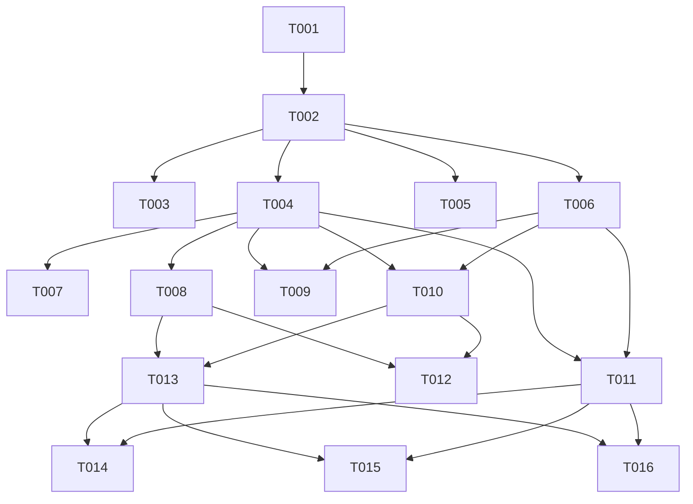

# Tasks: Collapse Overlapping and Same-Day Visits in HCRU Enrichers

**Branch**: `011-collapse-overlapping-visits` | **Spec**: [spec.md](spec.md) | **Plan**: [plan.md](plan.md)

## Tasks

### Phase 1: Setup

- [X] T001 Initialize task tracking and verify testing fixtures in `packages/CohortUtilisation/tests/testthat/helper-eunomia.R` and `R/mockHERMES.R`

### Phase 2: Foundational

- [X] T002 Implement `validateCountBy()` helper in `packages/CohortUtilisation/R/utilities.R` to validate and normalize `countBy` (`"days"` vs `"records"`) and `collapseOverlapping` parameters

### Phase 3: User Story 1 - Same-Day Outpatient Visit Deduplication (Priority: P1)

- [X] T003 [P] [US1] Add unit tests for same-day outpatient visit deduplication and zero-filling in `packages/CohortUtilisation/tests/testthat/test-add-outpatient.R`
- [X] T004 [US1] Update `addOutpatientVisits()` in `packages/CohortUtilisation/R/addOutpatientVisits.R` to implement distinct visit start date aggregation (`countBy = "days"`) for GP, Specialist, and Other outpatient visits

### Phase 4: User Story 2 - Same-Day and Overlapping Emergency Visit Deduplication (Priority: P1)

- [X] T005 [P] [US2] Add unit tests for same-day emergency visit deduplication in `packages/CohortUtilisation/tests/testthat/test-add-emergency.R`
- [X] T006 [US2] Update `addEmergencyCare()` in `packages/CohortUtilisation/R/addEmergencyCare.R` to implement distinct visit start date / collapsed episode aggregation (`countBy = "days"`) for emergency department attendances

### Phase 5: User Story 3 - Specialty-Stratified Outpatient Deduplication (Priority: P2)

- [X] T007 [P] [US3] Add unit tests for specialty-specific distinct date counting vs global outpatient distinct dates in `packages/CohortUtilisation/tests/testthat/test-add-outpatient.R`
- [X] T008 [US3] Update `addOutpatientVisits()` specialty aggregation in `packages/CohortUtilisation/R/addOutpatientVisits.R` to compute distinct `visit_start_date` per specialty group independently

### Phase 6: User Story 4 - Multi-Setting Harmonization in `addVisits` and `extract_hcru` (Priority: P2)

- [X] T009 [P] [US4] Add unit tests for multi-setting `addVisits()` and `CohortEconomics::extract_hcru()` with distinct visit day counts in `packages/CohortUtilisation/tests/testthat/test-add-visits.R` and `packages/CohortEconomics/tests/testthat/test-stage2-hcru.R`
- [X] T010 [US4] Update `addVisits()` in `packages/CohortUtilisation/R/addVisits.R` to propagate `countBy` and `collapseOverlapping` across Inpatient, Outpatient, and Emergency settings
- [X] T011 [US4] Update `extract_hcru()` in `packages/CohortEconomics/R/hcru.R` to compute distinct visit dates for HCRU tables (`inpatient`, `outpatient`, `patient_summary`) while preserving exhaustive financial extraction in `costs` and `total_cost`

### Phase 7: User Story 5 - Configurable Count Granularity (`countBy = c("days", "records")`) (Priority: P3)

- [X] T012 [P] [US5] Add unit tests for `countBy = "records"` and `collapseOverlapping = FALSE` across all enrichers in `packages/CohortUtilisation/tests/testthat/test-add-outpatient.R` and `packages/CohortUtilisation/tests/testthat/test-add-emergency.R`
- [X] T013 [US5] Ensure parameter defaults, error handling, and parameter aliases in `packages/CohortUtilisation/R/addOutpatientVisits.R`, `packages/CohortUtilisation/R/addEmergencyCare.R`, and `packages/CohortUtilisation/R/addVisits.R`

### Phase 8: Polish & Monorepo Conformance

- [X] T014 [P] Update Roxygen documentation and rebuild `.Rd` files using `make document` across `CohortUtilisation`, `CohortEconomics`, and root `omopHeor`
- [X] T015 [P] Update vignettes and pkgdown reference to illustrate distinct visit day counts in `vignettes/cohort-utilization.Rmd` and `vignettes/hcru_logic.Rmd`
- [X] T016 Run full test suites (`make test`) and CRAN checks (`make check`) to verify zero errors and zero warnings across the monorepo

---

## Dependencies & Execution Order

### Parallel Execution Groups

- **Group 1 (US1 & US2 Tests)**: T003 (`test-add-outpatient.R`), T005 (`test-add-emergency.R`)
- **Group 2 (US1 & US2 Implementation)**: T004 (`addOutpatientVisits.R`), T006 (`addEmergencyCare.R`)
- **Group 3 (US3 & US4 Tests)**: T007 (`test-add-outpatient.R`), T009 (`test-add-visits.R`, `test-stage2-hcru.R`)
- **Group 4 (Documentation & Vignettes)**: T014, T015

---

## Implementation Strategy

1. **MVP (Phase 1 to 4)**: Implement foundational validation helper and same-day visit deduplication for outpatient and emergency visits (User Story 1 and User Story 2).
2. **Incremental Delivery (Phase 5 & 6)**: Expand to specialty-stratified deduplication, multi-setting `addVisits()`, and `CohortEconomics::extract_hcru()`.
3. **Full Polish (Phase 7 & 8)**: Support `countBy = "records"`, regenerate monorepo documentation, refresh vignettes, and run CRAN checks.
