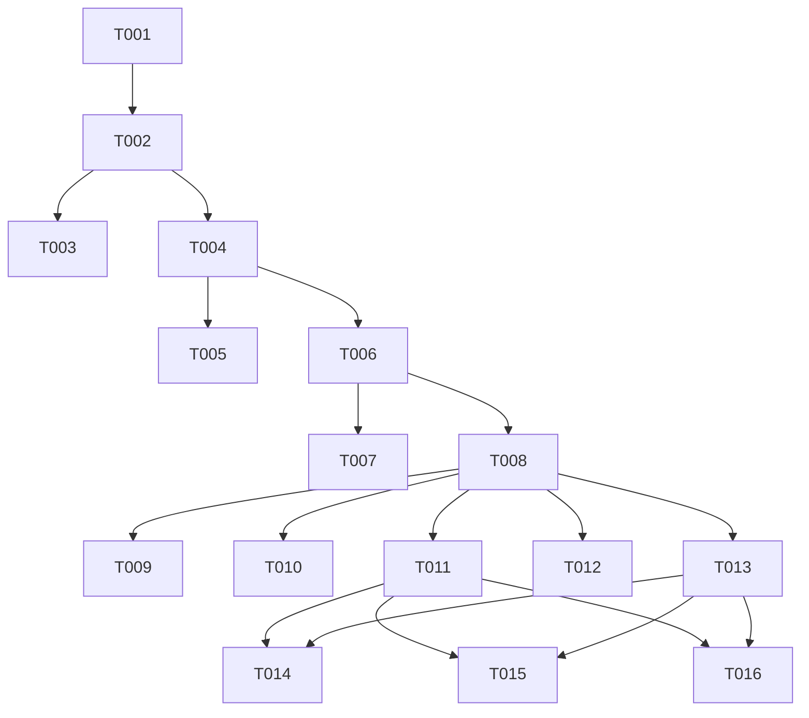

# Tasks: Collapse Overlapping and Contiguous Inpatient Stays in `addInpatients`

**Branch**: `012-collapse-overlapping-inpatients` | **Spec**: [spec.md](spec.md) | **Plan**: [plan.md](plan.md)

## Tasks

### Phase 1: Setup

- [X] T001 Initialize task tracking and verify baseline test suite in `packages/CohortUtilisation/tests/testthat/test-add-inpatients.R`

### Phase 2: Foundational

- [X] T002 Verify `validateCountBy()` support and parameter signatures in `packages/CohortUtilisation/R/utilities.R` for inpatient enrichers

### Phase 3: User Story 1 - Overlapping & Contiguous Inpatient Episode Collapsing (Priority: P1)

- [X] T003 [P] [US1] Add unit tests for overlapping and contiguous inpatient stay collapsing in `packages/CohortUtilisation/tests/testthat/test-add-inpatients.R`
- [X] T004 [US1] Implement interval collapsing algorithm (`cummax` + `gap <= 1 day`) in `packages/CohortUtilisation/R/addInpatients.R` for `collapseOverlapping = TRUE`

### Phase 4: User Story 2 - True Readmission Detection on Collapsed Episodes (Priority: P1)

- [X] T005 [P] [US2] Add unit tests for transfer vs true readmission detection in `packages/CohortUtilisation/tests/testthat/test-add-inpatients.R`
- [X] T006 [US2] Update readmission calculation (30d / 90d) in `packages/CohortUtilisation/R/addInpatients.R` to evaluate lag strictly across collapsed episodes

### Phase 5: User Story 3 - ICU and Specialty Accounting within Collapsed Hospitalizations (Priority: P2)

- [X] T007 [P] [US3] Add unit tests for embedded ICU stays and specialty breakdown in collapsed hospitalizations in `packages/CohortUtilisation/tests/testthat/test-add-inpatients.R`
- [X] T008 [US3] Integrate ICU sub-stay duration and specialty flags within collapsed episodes in `packages/CohortUtilisation/R/addInpatients.R` and `addIcuStays()`

### Phase 6: User Story 4 - Multi-Setting & Downstream Harmonization (`addVisits`, `extract_hcru`) (Priority: P2)

- [X] T009 [P] [US4] Add unit tests for `addVisits()` and `CohortEconomics::extract_hcru()` with collapsed inpatient stays in `packages/CohortUtilisation/tests/testthat/test-add-visits.R` and `packages/CohortEconomics/tests/testthat/test-stage2-hcru.R`
- [X] T010 [US4] Update `addVisits()` in `packages/CohortUtilisation/R/addVisits.R` to forward `collapseOverlapping` and `countBy` to `addInpatients()`
- [X] T011 [US4] Update `extract_hcru()` in `packages/CohortEconomics/R/hcru.R` to compute collapsed inpatient admissions and non-overlapping LOS

### Phase 7: User Story 5 - Lifecycle Deprecation of `computeHospitalizationCohorts` (Priority: P3)

- [X] T012 [P] [US5] Add deprecation test and warning assertion for `computeHospitalizationCohorts()` in `packages/CohortUtilisation/tests/testthat/test-hospitalizations.R`
- [X] T013 [US5] Add lifecycle deprecation note in `packages/CohortUtilisation/R/hospitalizations.R` pointing users to `addInpatients()` for HCRU

### Phase 8: Polish & Monorepo Conformance

- [X] T014 [P] Update Roxygen documentation and rebuild `.Rd` files using `make document` across `CohortUtilisation`, `CohortEconomics`, and root `omopHeor`
- [X] T015 [P] Update vignettes and pkgdown reference in `vignettes/cohort-utilization.Rmd` and `vignettes/hcru_logic.Rmd`
- [X] T016 Run full test suites (`make test`) and CRAN checks (`make check`) to verify zero errors and zero warnings

---

## Dependencies & Execution Order

### Parallel Execution Groups

- **Group 1 (US1 Tests)**: T003 (`test-add-inpatients.R`)
- **Group 2 (US2 & US3 Tests)**: T005, T007 (`test-add-inpatients.R`)
- **Group 3 (US4 & US5 Tests)**: T009, T012 (`test-add-visits.R`, `test-hospitalizations.R`)
- **Group 4 (Documentation & Polish)**: T014, T015
